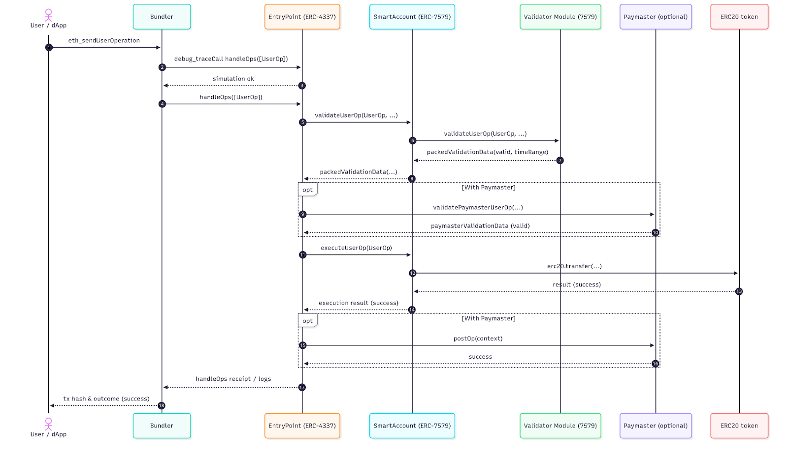

# Architecture

The factory and all modules are behind `TransparentUpgradeableProxy`s.

Factory deploys `BeaconProxy`s that point to the `UpgradeableBeacon` which in turn has the account implementation address.

The following is a sequence diagram for the general SSO user flow:

