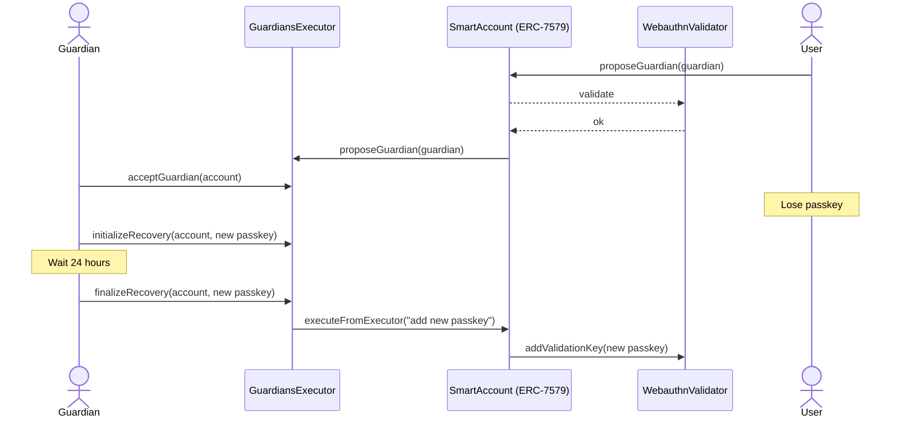

# Modules

Currently, only validator, fallback and executor module types are supported (as defined in the standard).

To install, uninstall or unlink a module, call the corresponding core functions on the account contract:

- `installModule(uint256 typeId, address module, bytes calldata initData)`
- `uninstallModule(uint256 typeId, address module, bytes calldata deinitData)`
- `unlinkModule(uint256 typeId, address module, bytes calldata deinitData)`

`typeId`, according to the [standard](https://eips.ethereum.org/EIPS/eip-7579):
- 1 for validator
- 2 for executor
- 3 for fallback

The account will call module's `onInstall(bytes)` hook upon installation and `onUninstall(bytes)` hook upon uninstall and unlink. The format for the supplied data is different for each module and is described below.

Unlinking is the same as uninstalling, but does not fail if `onUninstall` call to the module fails. Instead, error is emitted as `ModuleUnlinked(uint256 indexed typeId, address indexed module, bytes errorMsg)` event.

A single contract can house multiple module types, each type is installed separately.

## `EOAKeyValidator`

Stores EOA addresses as account owners. Each address has full "admin" privileges to the account, as long as this validator is installed.

- `onInstall` data format: ABI-encoded array of addresses - initial owners
- `onUninstall` data format: ABI-encoded array of addresses - owners to remove

Other methods:
- `addOwner(address owner)` - adds an EOA owner, emits `OwnerAdded(address indexed account, address indexed owner)`
- `removeOwner(address owner)` - removes existing EOA owner, emits `OwnerRemoved(address indexed account, address indexed owner)`
- `isOwnerOf(address account, address owner) returns (bool)` - whether or not an address is an owner of the account

## `WebAuthnValidator`

Stores WebAuthn passkeys per origin domain for each account. Each passkey has full "admin" privileges to the account, as long as this validator is installed.

- `onInstall` data format: ABI-encoded `(bytes credentialId, bytes32[2] publicKey, string domain)` - initial passkey, or empty
- `onUninstall` data format: ABI-encoded array of `(string domain, bytes credentialId)` - passkeys to remove

Other methods:
- `addValidationKey(bytes credentialId, bytes32[2] newKey, string domain)` - adds new passkey
- `removeValidationKey(bytes credentialId, string domain)` - removes existing passkey
- `getAccountKey(string domain, bytes credentialId, address account) returns (bytes32[2])` - account's public key on the domain with given credential ID
- `getAccountList(string domain, bytes credentialId) returns (address[])` - list of accounts on the domain with given credential ID (normally length of 1)

## `SessionKeyValidator`

Grants a 3rd party limited access to the account with configured permissions.

A session is defined by the following structure:

```solidity
struct SessionSpec {
    address signer;
    uint48 expiresAt;
    UsageLimit feeLimit;
    CallSpec[] callPolicies;
    TransferSpec[] transferPolicies;
}
```

- `signer` - Address corresponding to an EOA private key that will be used to sign session transactions. **Signers are required to be globally unique.**
- `expiresAt` - Timestamp after which the session no longer can be used. **Session expiration is required to be no earlier than 60 seconds after session creation.**
- `feeLimit` - a `UsageLimit` (explained below) structure that limits how much fees this session can spend. **Required to not be `Unlimited`.**
- `callPolicies` - a `CallSpec` (explained below) array that defines what kinds of calls are permitted in the session. **The array has to have unique (`target`, `selector`) pairs.**
- `transferPolicies` - a `TransferSpec` (explained below) array that defines what kinds of transfers (calls with no calldata) are permitted in the session. **The array has to have unique targets.**

### Usage Limits

All usage limits are defined by the following structure:

```solidity
struct UsageLimit {
    LimitType limitType;  // can be Unlimited (0), Lifetime (1) or Allowance (2)
    uint256 limit;        // ignored if limitType == Unlimited
    uint48 period;        // ignored if limitType != Allowance
}
```

- `limitType` defines what kind of limit (if any) this is.
    - `Unlimited` does not define any limits.
    - `Lifetime` defines a cumulative lifetime limit: sum of all uses of the value in the current session has to not surpass `limit`.
    - `Allowance` defines a periodically refreshing limit: sum of all uses of the value during the current `period` has to not surpass `limit`.
- `limit` - the actual number to limit by.
- `period` - length of the period in seconds.

### Transfer Policies

Transfer policies are defined by the following structure:

```solidity
struct TransferSpec {
    address target;
    uint256 maxValuePerUse;
    UsageLimit valueLimit;
}
```

- `target` - address to which transfer is being made.
- `maxValuePerUse` - maximum value that is possible to send in one transfer.
- `valueLimit` - cumulative transfer value limit.

### Call Policies

Call policies are defined by the following structure:

```solidity
struct CallSpec {
    address target;
    bytes4 selector;
    uint256 maxValuePerUse;
    UsageLimit valueLimit;
    Constraint[] constraints;
}
```

- `target` - address to which call is being made.
- `selector` - selector of the method being called.
- `maxValuePerUse` - maximum value that is possible to send in one call.
- `valueLimit` - cumulative call value limit.
- `constraints` - array of `Constraint` (explained below) structures that define constraints on method arguments.

### Call Constraints

Call constraints are defined by the following structures:

```solidity
struct Constraint {
    Condition condition;
    uint64 index;
    bytes32 refValue;
    UsageLimit limit;
}


enum Condition {
    Unconstrained,
    Equal,
    Greater,
    Less,
    GreaterOrEqual,
    LessOrEqual,
    NotEqual
}
```

- `index` - index of the argument in the called method, starting with 0, assuming all arguments are 32-byte words after ABI-encoding.
    - E.g., specifying `index: X` will constrain calldata bytes `4+32*X:4+32*(X+1)`
- `limit` - usage limit for the argument interpreted as `uint256`.
- `condition` - how the argument is required to relate to `refValue`: see `enum Condition` above.
- `refValue` - reference value for the condition; ignored if condition is `Unconstrained`.

### `SessionKeyValidator` Methods

- `onInstall` data format: empty
- `onUninstall` data format: ABI-encoded array of session hashes to revoke

Other methods:
- `createSession(SessionSpec spec, bytes proof)` - create a new session; requires `proof` - a signature of the hash `keccak256(abi.encode(sessionHash, accountAddress))` signed by session `signer`
- `revokeKey(bytes32 sessionHash)` - closes an active session by the provided hash
- `revokeKeys(bytes32[] sessionHashes)` - same as `revokeKey` but closes multiple sessions at once
- `sessionStatus(address account, bytes32 sessionHash) returns (SessionStatus)` - returns `NotInitialized` (0), `Active` (1) or `Closed` (2); note: expired sessions are still considered active if not revoked explicitly
- `sessionState(address account, SessionSpec spec) returns (SessionState)` - returns the session status and the state of all cumulative limits used in the session as a following structure:

```solidity
// Info about remaining session limits and its status
struct SessionState {
    Status status;
    uint256 feesRemaining;
    LimitState[] transferValue;
    LimitState[] callValue;
    LimitState[] callParams;
}

struct LimitState {
    uint256 remaining; // this might also be limited by a constraint or `maxValuePerUse`, which is not reflected here
    address target;
    bytes4 selector;   // ignored for transfer value
    uint256 index;     // ignored for transfer and call value
}
```

Note: `sessionHash` is what is stored on-chain, and is defined by `keccak256(abi.encode(sessionSpec))`.

## `GuardianExecutor`

Stores addresses trusted by the account to perform an EOA or WebAuthn key recovery. Either `EOAKeyValidator` or `WebAuthnValidator` must be installed.

The flow is the following:



Important notes:
- Account owner has to first propose to another address to be its guardian
- After the guardian address accepts, it can initiate a recovery
- Recovery can be either for an EOA key or a Webauthn passkey, given that a corresponding validator is installed on the account
- Any guardian can initiate a recovery alone. Guardians can themselves be multisig accounts if that is desired
- A user can discard an initiated recovery in case one of the guardians is malicious
- Recovery can be finalized not earlier than 24 hours and not later than 72 hours after initiating it
- Only one recovery can be ongoing at a time

### `GuardianExecutor` Methods

- `onInstall` data format: empty
- `onUninstall` data format: empty

Other methods:
- `proposeGuardian(address newGuardian)` - propose an address to be a guardian
- `acceptGuardian(address accountToGuard)` - an address that was proposed to can accept its role as a guardian
- `initializeRecovery(address accountToRecover, RecoveryType recoveryType, bytes data)` - initialize recovery of an EOA key (`recoveryType` 1) or passkey (`recoveryType` 2) of an account; `data` is ABI-encoded arguments to `EOAKeyValidator.addOwner` or `WebAuthnValidator.addValidationKey`
- `finalizeRecovery(address account, bytes data)` - finalize an ongoing recovery; the same data has to be passed in as was passed during initializing
- `discardRecovery()` - discard an ongoing recovery
- `guardianStatusFor(address account, address guardian) returns (bool isPresent, bool isActive)` - whether a given address was proposed to (is present) and has accepted (is active)
